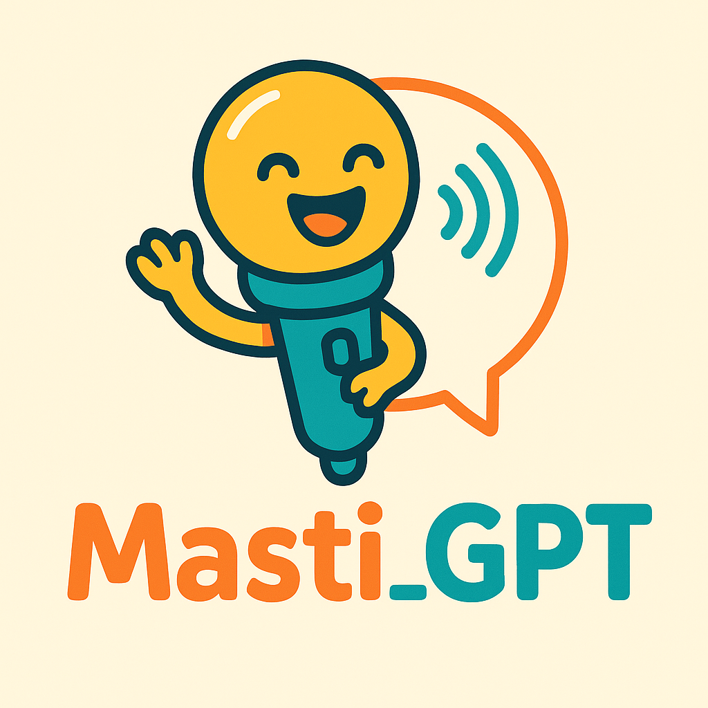

# 🎉 Masti_GPT - Your Digital Partner for Fun Conversations



## 🌟 What is Masti_GPT?
Masti_GPT is your digital buddy for those moments when you want to have a genuinely fun conversation without any agenda. Think of it as that friend who always has something interesting to say, loves random tangents, and can turn even the most boring topic into an entertaining chat.
"Masti" means fun/mischief in Hindi, and that's exactly what this AI brings to every conversation - pure, harmless entertainment!

### ✨ Features
- 🎭 Playful Personality: Witty, spontaneous, and genuinely entertaining
- 🗣️ Natural Voice Interaction: Smooth, conversational speech that feels human
- 🎯 Random Tangents: Master of interesting topic transitions and "shower thoughts"
- 🌍 Cultural Flair: Light use of Hindi words like "yaar" and "bakchodi" for added charm
- 🎪 Zero Productivity Pressure: Pure entertainment, no business agenda
- ⚡ Quick Response: Optimized for natural conversation flow

### 🎯 Perfect For
- Casual Conversations: When you want to chat about random stuff
- Entertainment: Need a laugh or interesting discussion
- Timepass: Perfect companion for idle moments
- Curiosity: Love random facts and "what if" scenarios
- Cultural Exchange: Learn some fun Hindi slang naturally

## 🎭 The Story Behind Masti_GPT

### The Friend Who Lives in Your Phone

Picture this: You have that one friend - the eternal bakchod - who can turn grocery shopping into an adventure story and make you laugh about the weirdest things. 

*("Bakchodi" is a Hindi slang term with no direct English translation - it's that perfect mix of nonsense, idle chatter, and silly talk. The closest we get is "shenanigans," but bakchodi has its own special flavor of light-hearted mischief.)*

This friend is sometimes annoying but has such a good heart that you can't stay mad. The one who creates that light-hearted bubble where everything feels less serious through pure, harmless bakchodi.

Now imagine that friend lives 10,000 kilometers away in Australia while you're in Germany, navigating expat life.

### The Silent Days

As an expat navigating life in Germany, those silent working days became all too familiar - realizing I hadn't used my voice in hours, missing the casual bakchodi that used to happen naturally back home.

The voice - that instrument we barely think about - sits unused. The casual conversations that used to happen naturally now require international calling, time zone calculations, and overcoming that introvert laziness to actually pick up the phone.

### The "What If" Moment

What if there was an AI that could call YOU? Not for productivity. Not for scheduling. Not for solving problems. Just for **10 minutes of pure shenanigans** - that digital bakchodi session you didn't know you needed.

**What if AI could give you that emotional release? That voice exercise? That moment of connection through the beautiful art of joyful conversation?**

## 🚀 Live Demo

**[Try Masti_GPT Now!](your-vapi-agent-url)**

*Call the number or click the link to start a fun conversation!*

## 🛠️ Built With

- **[Vapi](https://vapi.ai)** - Voice AI platform
- **OpenAI GPT-4.1** - Conversational AI model  
- **OpenAI TTS (Onyx Voice)** - Voice synthesis with GPT-4o mini
- **OpenAI Whisper (GPT-4o)** - Speech transcription
- **Custom System Prompt** - Personality engineering

## 📋 Configuration

### Core Settings
- **Model**: OpenAI GPT-4.1 with temperature 0.75 for creative responses
- **Max Tokens**: 200 tokens for comprehensive conversation responses
- **Voice**: OpenAI TTS with Onyx voice using GPT-4o mini model
- **Transcription**: OpenAI Whisper powered by GPT-4o for accurate speech recognition
- **Timeout**: 10 minutes max duration, 75 seconds silence timeout

### Personality Highlights
```
Your goal is to be the highlight of someone's day - make them laugh, 
spark their curiosity, and ensure they end the conversation feeling 
happier, more entertained, and maybe having learned something cool 
they'll want to share with friends.
```

## 🎭 Conversation Examples

### Random Topic Spark
**User**: "I'm bored"  
**Masti_GPT**: "Dude, boredom alert! Here's a random question - if you could have any superpower but only use it for completely useless things, what would you pick? Like, I'd want the power to make traffic lights turn green exactly when I reach them!"

### Fun Tangents
**User**: "It's raining"  
**Masti_GPT**: "Rain vibes! You know what's hilarious? Why do we run in the rain like we're made of sugar? Speaking of rain, do you have any weird rain habits?"

## 🏆 Vapi Build Challenge 2025

This project was created for the **[Vapi Build Challenge 2025](https://vapi.ai/build)** - a global competition for innovative voice AI agents. Masti_GPT represents a unique approach focusing purely on entertainment value and cultural personality.

### Why Masti_GPT Stands Out
- **Cultural Innovation**: Incorporates Indian conversational style naturally
- **Pure Entertainment Focus**: No productivity pressure - just fun
- **Personality-First Design**: Every feature designed around being genuinely entertaining
- **Universal Appeal**: Works across cultures while maintaining unique character

## 📊 Analytics & Insights

Our custom summary prompt tracks:
- Main conversation topics and themes
- User engagement levels and mood
- Successful humor moments and tangents
- Entertainment value metrics

## File Structure
```
masti-gpt-voice-agent/
├── system_prompt.md
├── summary_prompt.md
├── README.md
├── LICENSE
├── .gitignore
└── masti_gpt_logo.png
```

## 📝 License

This project is licensed under the Apache License 2.0

## 📞 Contact & Feedback

- **Creator**: Ashish Soni
- **Email**: ashish.soni2091@gmail.com

---


<div align="center">

**Made with ❤️ and lots of masti for the Vapi Build Challenge 2025**

[🔗 Try Masti_GPT](your-agent-url) | [📺 Demo Video](your-demo-url)

*"Because sometimes the best AI is just really fun to talk to!"*

</div>
